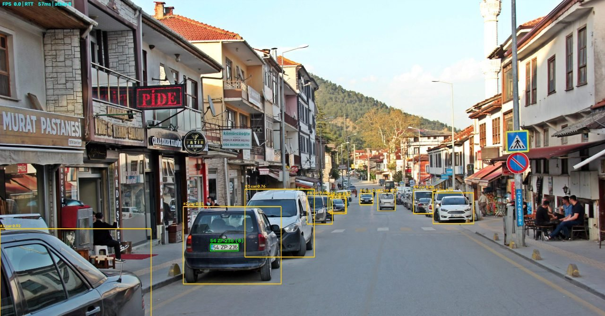
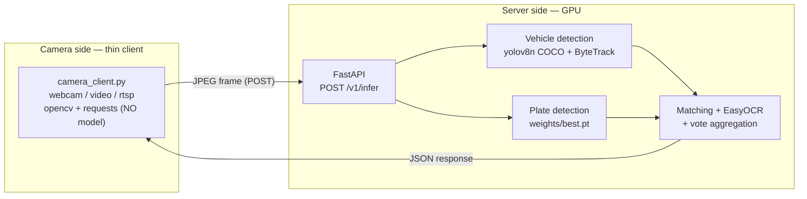
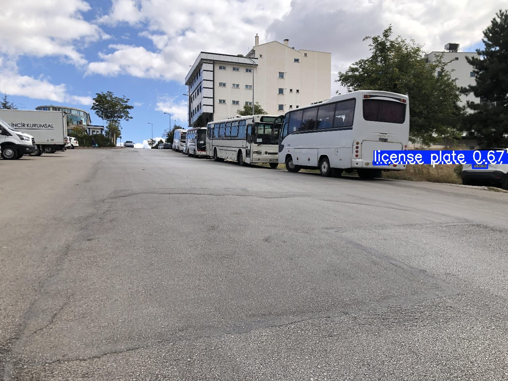
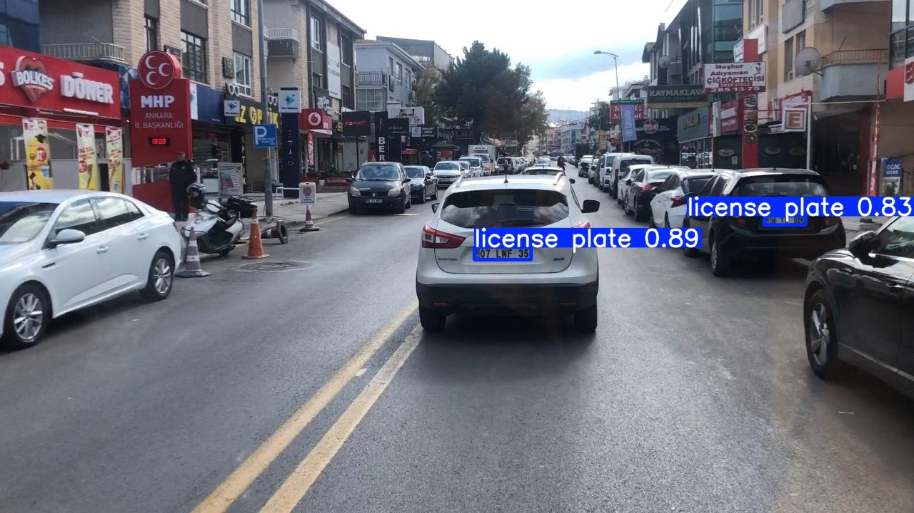

# Turkish License Plate Reader — Client/Server Inference Service

A two-stage system (vehicle + plate detection → OCR) that reads Turkish vehicle
license plates. It is packaged as a GPU-side **inference server** and a **thin
HTTP client** that runs on the camera. The output is JSON only.

## Screenshot (real system output)

The image below was produced by the client drawing a real `/v1/infer` response
(vehicle boxes + `track_id` + class/confidence, plate box and the read text, with
FPS/RTT/dropped-frames in the corner):



## Architecture

Models live **only on the server**; the camera-side client has no model, no GPU
and no torch.



## Example response (`POST /v1/infer`)

The JSON below is from a **real run** (truncated: the response contained 10
vehicles in total; 2 are shown — one with a plate, one without):

```json
{
  "camera_id": "jsonex",
  "frame_ts": 1730000000003,
  "latency_ms": 59,
  "frame_w": 2560,
  "frame_h": 1707,
  "vehicles": [
    {
      "track_id": 2,
      "class": "car",
      "box": [775, 876, 1189, 1204],
      "conf": 0.9096353650093079,
      "plate": {
        "box": [889, 1034, 1008, 1064],
        "conf": 0.7778225541114807,
        "raw": "54ZP236",
        "text": "54 ZP 236",
        "valid": true,
        "votes": 4
      }
    },
    {
      "track_id": 1,
      "class": "car",
      "box": [0, 970, 639, 1695],
      "conf": 0.9227374792098999,
      "plate": null
    }
  ],
  "orphan_plates": []
}
```

- All `box` values are integer pixels `[x1,y1,x2,y2]` in the server's processed
  `frame_w × frame_h` plane.
- `plate.valid` is the single decision flag consumers should read; `text` returns
  the best guess even when invalid. `votes` is the number of readings supporting
  the result.
- If there are no vehicles, `vehicles` is an empty list (not an error).

## Quick start

> **All commands are run from the repository root** (`shared/`, `server/`,
> `client/` are resolved as packages from here). Commands are for Windows
> (PowerShell).

### Server environment (GPU machine)

```powershell
python -m venv .venv
.venv\Scripts\Activate.ps1

# ⚠️ Install torch with the CORRECT CUDA variant, otherwise GPU silently disappears.
# This machine uses CUDA 12.6 -> cu126 index. The index-url depends on your card.
pip install torch==2.13.0+cu126 torchvision==0.28.0+cu126 `
    --index-url https://download.pytorch.org/whl/cu126
pip install -r requirements.txt

# ⚠️ --workers 1 is MANDATORY: multiple workers copy the model into memory and
#    will overflow a 4 GB card.
uvicorn server.app:app --host 127.0.0.1 --port 8000 --workers 1
```

Verify torch: `python -c "import torch; print(torch.__version__, torch.cuda.is_available())"`
→ you should see `2.13.0+cu126 True`. If you see `+cpu` instead, the index-url
step was skipped.

Config: `copy config.example.yaml config.yaml` (runs with defaults if absent).
Precedence: **CLI > environment variable (`PLATE_*`) > config.yaml > default**.

### Client environment (camera machine — NO model/GPU)

```powershell
python -m venv client\.venv
client\.venv\Scripts\Activate.ps1
pip install -r client\requirements.txt      # only opencv-python + requests

python client\camera_client.py --server http://SERVER:8000 --camera-id gate1 --source 0 --fps 5
python client\camera_client.py --source video.mp4 --headless          # video, no GUI
python client\camera_client.py --source "rtsp://user:pass@ip:554/stream"
```

## Model metrics (Stage 1 — plate detection)

YOLOv8n, **50 epochs**, imgsz 640. Dataset (Roboflow, single class
`license plate`): **train 3150 · valid 345 · test 5** images. The values below
were measured on the **validation set (345 images)** (`results/metrics.md`):

| Metric | Value |
|---|---|
| mAP@0.5 | 0.9375 |
| mAP@0.5:0.95 | 0.7514 |
| Precision | 0.8397 |
| Recall | 0.9345 |

> These are the **plate-detection model's** validation metrics — they are **not**
> end-to-end system accuracy (see below). Sample predictions showing model
> quality:




## Performance measurements

**Measurement environment:** NVIDIA GeForce GTX 1650 (4096 MB), Windows 10,
Python 3.11.9. **Client and server on the same machine (localhost)** — on a real
network the RTT increases. The values below were measured on this machine with
`plateTest1.png` (2560×1707):

| Measurement | Value |
|---|---|
| Server `latency_ms` — cold start (first request, loads the camera's model) | 518 ms |
| Server `latency_ms` — warm, OCR triggered | 58–68 ms (avg ~63) |
| Server `latency_ms` — warm, no OCR (vote stable) | 29–31 ms |
| Client RTT (localhost) — warm, with / without OCR | ~77–90 ms / ~48–57 ms |
| `gpu_memory_reserved_mb` (1 camera loaded) | 235 MB (5.7% of 4096 MB) |
| Backpressure: 40-frame video | 7 processed, 33 dropped |

OCR runs only until a track has a stable result; it stops once the vote window is
full (the "no OCR" row above shows this). The high drop rate is intentional: the
client keeps **one request in flight** at a time and drops frames that arrive
while waiting for a response (so latency does not accumulate).

## Test suite

**47 tests**, pytest. Per file: `test_plate_format` 17, `test_vote` 15,
`test_schemas` 8, `test_box_match` 7. **No test requires a model, GPU or camera**
(pure logic: format validation, vote aggregation, box matching, schema).

```powershell
pip install -r requirements-dev.txt
pytest -q            # from the repository root
```

## Project structure

```
shared/plate_format.py   # TR plate format validation + OCR confusion fixes (pure)
server/schemas.py        # Pydantic request/response contract
server/session.py        # per camera_id/track vote state + pure vote()
server/inference.py      # vehicle+plate detection, box matching, per-track OCR
server/app.py            # FastAPI: /v1/infer, /health (asyncio lock + executor)
client/camera_client.py  # thin client (opencv+requests); single-in-flight + backoff
tests/                   # pytest (model-free)
config.example.yaml      # server/client settings (precedence: CLI>env>yaml>default)
# --- Stage 1 training/inference tools (CLI, offline) ---
download_data.py         # download data from Roboflow (API key from env)
train.py / resume_training.py / train.ipynb   # plate model training
predict.py / pipeline.py / ocr.py             # single/folder inference
live.py                  # local live camera (OpenCV window, no server)
```

## Weights file (`weights/best.pt`)

**This file is NOT in the repo** (it is in `.gitignore`; trained weights are not
distributed). The server **will not start** without it — it stops with a clear
error. To obtain it:

1. `python download_data.py` — download the data from Roboflow (free API key as
   `ROBOFLOW_API_KEY` in `.env`).
2. `python train.py --batch 8` (or `train.ipynb`) — Stage 1 training; at the end
   the weights are copied to `weights/best.pt`.

The vehicle model `yolov8n.pt` (COCO) is downloaded automatically by Ultralytics
if missing — it is not retrained.

## Out of scope (deliberately absent at this stage)

The output is **JSON over HTTP only**. The following are **intentionally absent**
and left to later stages:

- Database / ORM / persistence (state is in RAM only)
- Events, cooldown, de-duplication
- Allow-list / block-list
- Barrier / relay / gate control
- User management, authentication, API keys
- Saving images/frames to disk
- Docker / container packaging

## Known limitations (honest)

- **End-to-end verification is a SMOKE TEST, not an accuracy measurement.** The
  system was verified with a single test image (`plateTest1.png`) and a short
  video produced from it. There is **no** "system accuracy XX%" claim, and none
  should be made.
- **No automated tests for the model layer** — `inference.py` and the FastAPI
  endpoints were only smoke-tested by hand (there are pure-logic tests, no model).
- **RTSP not field-tested** — the code exists (`CAP_FFMPEG` + TCP), but it was
  not tried with a real camera.
- **Verified on Windows only.** Not tried on Linux/macOS.
- **OCR breaks on plates below ≈40 px** — a source-resolution limit; preprocessing
  does not fix it.
- **Single worker / single GPU** — requests are serialized; latency accumulates
  under load.
- **No authentication** — the endpoints are fully open (required in production).
- **Performance numbers were measured on localhost** — RTT increases on a real
  network.

## License and attribution

- Code: [MIT](LICENSE)
- Dataset: **License Plates of Vehicles in Turkey**, Kemal Kılıçaslan, Roboflow
  Universe — [CC BY 4.0](https://creativecommons.org/licenses/by/4.0/). The
  project downloads from a public mirror of the same content
  (`tr-plaka-recognition/license-plates-of-vehicles-in-turkey-s3tbj-s5lcc`);
  attribution belongs to the original creator.

The dataset and trained weights are **not distributed** in this repo.
