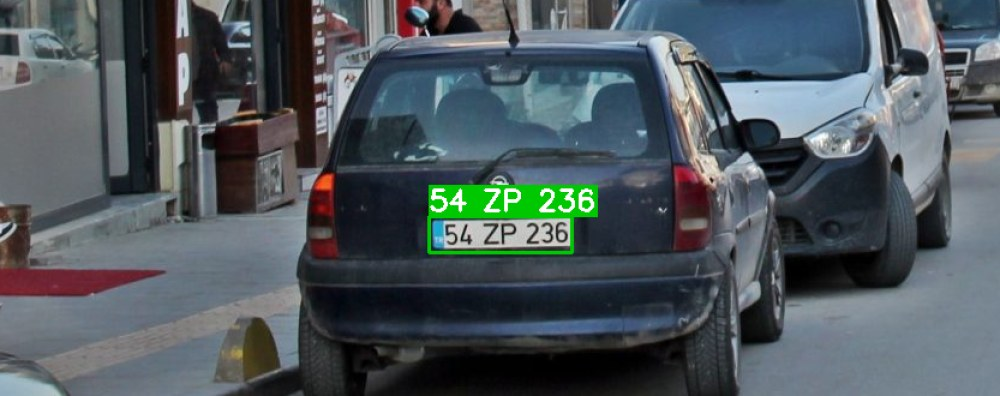

# Türk Plaka Okuma — YOLOv8 + OCR (İki Aşamalı)

Türk araç plakalarını uçtan uca okuyan iki aşamalı bir sistem:

- **Aşama 1 — Tespit:** Görüntüde plakanın **yerini** bulan bir YOLOv8n modeli;
  tespit edilen plaka bölgesini kırpar.
- **Aşama 2 — OCR:** Kırpılan plakadan **metni** okuyan katman
  (EasyOCR + Türk plaka format doğrulaması) → `34 ABC 123`.

Aşağıda uçtan uca bir örnek — plaka tespit edilip okunmuş (yeşil kutu = tespit,
üstteki etiket = OCR'ın okuduğu metin):



## Repo yapısı

```
├── download_data.py   # Roboflow'dan veri indirme (API anahtarı env'den)
├── train.py           # Aşama 1: yerel eğitim + değerlendirme
├── train.ipynb        # Aşama 1: Google Colab notebook (önerilen eğitim yöntemi)
├── resume_training.py # Kesilen eğitimi kontrol noktasından sürdürme
├── predict.py         # Aşama 1: tespit + plaka kırpma
├── ocr.py             # Aşama 2: kırpılmış plaka → metin (EasyOCR + doğrulama)
├── pipeline.py        # Uçtan uca: tespit + OCR
└── requirements.txt
```

## Kurulum

Python 3.10+ gerekir.

```bash
git clone <bu-repo>
cd turkish-plate-reader
pip install -r requirements.txt
```

## Veri indirme

Veri seti Roboflow Universe'te barındırılıyor ve **repoya dahil değildir**
(bkz. `.gitignore`). Kendiniz indirmeniz gerekir:

1. Ücretsiz bir Roboflow hesabı açın ve API anahtarınızı alın:
   https://app.roboflow.com/settings/api
2. Anahtarı **ortam değişkeni** olarak tanımlayın (koda/dosyaya gömmeyin):

   ```bash
   # Linux / macOS
   export ROBOFLOW_API_KEY="anahtariniz"

   # Windows PowerShell
   $env:ROBOFLOW_API_KEY="anahtariniz"
   ```

   Alternatif olarak proje kökünde bir `.env` dosyasına
   `ROBOFLOW_API_KEY=...` yazabilirsiniz (`.env` gitignore'dadır).

3. İndirin:

   ```bash
   python download_data.py
   ```

Veri `datasets/turkish-plates/` altına YOLOv8 formatında iner
(`data.yaml` dahil). Roboflow'un verdiği train/val bölünmesi olduğu gibi
kullanılır; YOLOv8'in eğitim-anı augmentation'ı ayrıca varsayılan ayarlarla
açıktır.

**Veri seti:** [License Plates of Vehicles in Turkey](https://universe.roboflow.com/tr-plaka-recognition/license-plates-of-vehicles-in-turkey-s3tbj-s5lcc)
— 3.501 görüntü, tek sınıf (`license plate`), lisans: **CC BY 4.0** (atıf için
aşağıya bakın).

## Eğitim

### Yöntem 1 — Google Colab (önerilen)

Eğitim GPU gerektirir; en kolay yol ücretsiz Colab GPU'su kullanmaktır.

1. `train.ipynb` dosyasını [Google Colab](https://colab.research.google.com)'da açın.
2. **Runtime → Change runtime type → T4 GPU** seçin.
3. Roboflow API anahtarınızı Colab **Secrets** paneline `ROBOFLOW_API_KEY`
   adıyla ekleyin (ya da notebook sorduğunda girin).
4. Hücreleri sırayla çalıştırın. Notebook veriyi indirir, modeli eğitir,
   metrikleri raporlar ve `best.pt`'yi bilgisayarınıza indirir.
5. İnen `best.pt`'yi yerel repoda `weights/` klasörüne koyun.

### Yöntem 2 — Yerel (GPU'lu makine)

```bash
python download_data.py
python train.py                      # varsayılan: epochs=50 imgsz=640 batch=16
python train.py --batch 8            # GPU belleği yetmezse batch'i düşürün
```

Eğitim sonunda en iyi ağırlık `weights/best.pt` olarak kopyalanır,
val metrikleri `results/metrics.md`'ye, örnek tahmin görüntüleri
`results/val_predictions/` altına yazılır.

> **Not:** Colab'ın ücretsiz T4 GPU'sunda da bellek yetmezliği (CUDA out of
> memory) görürseniz `batch=8` deneyin.

## Değerlendirme sonuçları

YOLOv8n, 50 epoch, imgsz=640, batch=8 (GTX 1650, 4 GB) ile eğitildi.
Val seti (345 görüntü) üzerinde:

| Metrik | Değer |
|---|---|
| mAP@0.5 | **0.9375** |
| mAP@0.5:0.95 | **0.7514** |
| Precision | 0.8397 |
| Recall | 0.9345 |

Örnek tespit (val setinden, güven skorlarıyla):


Kutu çizilmiş diğer örnek tahminler eğitim sonrası `results/val_predictions/`
klasörüne kaydedilir.

## Çıkarım (predict.py)

```bash
# Tek görüntü
python predict.py --source ornek.jpg

# Klasör + özel güven eşiği ve çıktı klasörü
python predict.py --source foto_klasoru/ --conf 0.4 --out predictions
```

Çıktılar:

- `predictions/annotated/` — tespit kutuları çizilmiş görüntüler
- `predictions/crops/` — **kırpılmış plaka bölgeleri** (her tespit ayrı dosya;
  bunlar Aşama 2'deki OCR'ın girdisi olacak)

Varsayılan güven eşiği `--conf 0.25`'tir.

## Aşama 2 — OCR (Plaka Okuma)

Kırpılan plaka bölgesi `ocr.py` ile metne çevrilir. Boru hattı:

1. **Ön işleme:** gri tonlama, büyütme, gürültü azaltma (bilateral filtre),
   kontrast (CLAHE) ve keskinleştirme.
2. **OCR:** [EasyOCR](https://github.com/JaidedAI/EasyOCR) ile karakter okuma
   (yalnızca plaka karakterlerine izin verilir: `0-9` ve `A-Z`).
3. **Türk plaka doğrulaması:** çıktı `2 rakam (il 01–81) + 1–3 harf + 2–4 rakam`
   desenine oturtulur; konuma göre karışıklıklar düzeltilir (rakam beklenen yerde
   `O→0, I→1, S→5`; harf beklenen yerde tersi) ve **en az düzeltme** gerektiren
   bölünme seçilir.

### Kullanım

```bash
# Uçtan uca (tespit + OCR), tek görüntü veya klasör
python pipeline.py --source foto.jpg
python pipeline.py --source test_fotolarim/ --conf 0.25 --out pipeline_out

# Yalnızca OCR (kırpılmış plakalar üzerinde)
python ocr.py --source predictions/crops
```

Okunan plaka metni görüntü üzerine yazılıp `pipeline_out/` altına kaydedilir.

### Sınırlar ve dürüst değerlendirme

- **Net/yakın plakalarda** doğru okur (yukarıdaki `54 ZP 236` örneği).
- **Çok küçük/bulanık plakalarda** (≈40 piksel altı) doğruluk düşer — bu, kaynak
  görüntü çözünürlüğünün fiziksel sınırıdır, ön işlemeyle aşılamaz.
- Bir **karakter-düzeyi YOLO** (36 sınıf) alternatifi de denendi; ancak hazır,
  küçük ve alan-uyuşmazlıklı bir veri setiyle eğitilen model gerçek Türk
  plakalarında EasyOCR'ın gerisinde kaldı (kendi doğrulama setinde yüksek skora
  rağmen). Verimli olması için **büyük ve Türk plakalarına uygun, karakter-etiketli
  bir veri seti** gerekir — gelecekteki iyileştirme yolu budur.

## Lisans ve atıf

- Kod: [MIT](LICENSE)
- Veri seti: **License Plates of Vehicles in Turkey**, Kemal Kılıçaslan,
  Roboflow Universe — [CC BY 4.0](https://creativecommons.org/licenses/by/4.0/)

  > Kılıçaslan, K. *License Plates of Vehicles in Turkey* [Veri seti].
  > Roboflow Universe. Lisans: CC BY 4.0.

  Bu proje, aynı veri setinin herkese açık bir kopyasından indirir:
  https://universe.roboflow.com/tr-plaka-recognition/license-plates-of-vehicles-in-turkey-s3tbj-s5lcc
  (yazarın orijinal `kemalkilicaslan-gzpvq` çalışma alanındaki sürüm indirme
  sırasında herkese açık değildi). İçerik aynıdır; CC BY 4.0 gereği atıf orijinal
  yaratıcı Kemal Kılıçaslan'adır.

Veri seti ve eğitilmiş ağırlıklar bu repoda **dağıtılmaz**; veriyi yukarıdaki
adımlarla kendiniz indirin.
