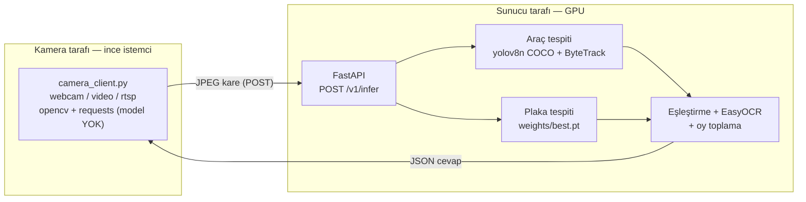

# Türk Plaka Okuma — İstemci/Sunucu Çıkarım Servisi

Türk araç plakalarını okuyan iki aşamalı bir sistem (araç + plaka tespiti → OCR),
GPU'lu bir **sunucuda** çalışan çıkarım servisi ve kamerada çalışan **ince bir
HTTP istemcisi** olarak paketlenmiştir. Çıktı yalnızca JSON'dur.

## Ekran görüntüsü (gerçek sistem çıktısı)

Aşağıdaki görüntü, istemcinin `/v1/infer` cevabını çizmesiyle üretildi (araç
kutuları + `track_id` + sınıf/güven, plaka kutusu ve okunan metin, köşede
FPS/RTT/atılan kare):


## Mimari

Modeller **yalnızca sunucuda**; kamerada çalışan istemcide model, GPU veya torch
yoktur.



## Örnek cevap (`POST /v1/infer`)

Aşağıdaki JSON **gerçek bir çalıştırmadan** alınmıştır (kısaltılmış: cevapta
toplam 10 araç vardı, biri plakalı biri plakasız olmak üzere 2'si gösteriliyor):

```json
{
  "camera_id": "jsonex",
  "frame_ts": 1730000000003,
  "latency_ms": 59,
  "frame_w": 2560,
  "frame_h": 1707,
  "vehicles": [
    {
      "track_id": 2,
      "class": "car",
      "box": [775, 876, 1189, 1204],
      "conf": 0.9096353650093079,
      "plate": {
        "box": [889, 1034, 1008, 1064],
        "conf": 0.7778225541114807,
        "raw": "54ZP236",
        "text": "54 ZP 236",
        "valid": true,
        "votes": 4
      }
    },
    {
      "track_id": 1,
      "class": "car",
      "box": [0, 970, 639, 1695],
      "conf": 0.9227374792098999,
      "plate": null
    }
  ],
  "orphan_plates": []
}
```

- Tüm `box` değerleri `[x1,y1,x2,y2]` tamsayı piksel, sunucunun işlediği
  `frame_w × frame_h` düzleminde.
- `plate.valid` tüketicinin bakacağı tek karar bayrağıdır; `text` geçersizken
  bile en iyi tahmini verir. `votes` sonucu destekleyen okuma sayısıdır.
- Hiç araç yoksa `vehicles` boş liste döner (hata değil).

## Hızlı başlangıç

> **Tüm komutlar repo kökünden çalıştırılır** (`shared/`, `server/`, `client/`
> paket olarak buradan çözümlenir). Komutlar Windows (PowerShell) içindir.

### Sunucu ortamı (GPU'lu makine)

```powershell
python -m venv .venv
.venv\Scripts\Activate.ps1

# ⚠️ torch'u DOĞRU CUDA varyantıyla kurun, yoksa GPU sessizce kaybolur.
# Bu makinede CUDA 12.6 -> cu126 index. Kartınıza göre index-url değişir.
pip install torch==2.13.0+cu126 torchvision==0.28.0+cu126 `
    --index-url https://download.pytorch.org/whl/cu126
pip install -r requirements.txt

# ⚠️ TEK worker ZORUNLU: çoklu worker model belleğini kopyalar, 4 GB kartta taşar.
uvicorn server.app:app --host 127.0.0.1 --port 8000 --workers 1
```

`torch` doğrulaması: `python -c "import torch; print(torch.__version__, torch.cuda.is_available())"`
→ `2.13.0+cu126 True` görmelisiniz. `+cu126` yerine `+cpu` görüyorsanız index-url
adımı atlanmış demektir.

Ayarlar: `copy config.example.yaml config.yaml` (yoksa varsayılanlarla çalışır).
Öncelik: **CLI > ortam değişkeni (`PLATE_*`) > config.yaml > varsayılan**.

### İstemci ortamı (kamera makinesi — model/GPU YOK)

```powershell
python -m venv client\.venv
client\.venv\Scripts\Activate.ps1
pip install -r client\requirements.txt      # yalnızca opencv-python + requests

python client\camera_client.py --server http://SUNUCU:8000 --camera-id kapi1 --source 0 --fps 5
python client\camera_client.py --source video.mp4 --headless          # video, GUI'siz
python client\camera_client.py --source "rtsp://kullanici:sifre@ip:554/stream"
```

## Model metrikleri (Aşama 1 — plaka tespiti)

YOLOv8n, **50 epoch**, imgsz 640. Veri seti (Roboflow, tek sınıf `license plate`):
**train 3150 · valid 345 · test 5** görüntü. Aşağıdaki değerler **validation seti
(345 görüntü)** üzerinde ölçüldü (`results/metrics.md`):

| Metrik | Değer |
|---|---|
| mAP@0.5 | 0.9375 |
| mAP@0.5:0.95 | 0.7514 |
| Precision | 0.8397 |
| Recall | 0.9345 |

> Bunlar **plaka tespit modelinin** validation metrikleridir — uçtan uca sistem
> doğruluğu **değildir** (aşağıya bakın). Model kalitesine dair örnek tahminler:


## Performans ölçümleri

**Ölçüm ortamı:** NVIDIA GeForce GTX 1650 (4096 MB), Windows 10, Python 3.11.9.
**İstemci ve sunucu aynı makinede (localhost)** — gerçek ağda RTT artar.
Aşağıdaki değerler bu makinede `plateTest1.png` (2560×1707) ile ölçüldü:

| Ölçüm | Değer |
|---|---|
| Sunucu `latency_ms` — soğuk başlangıç (ilk istek, kamera modeli yüklenir) | 518 ms |
| Sunucu `latency_ms` — ısınmış, OCR tetiklendi | 58–68 ms (ort. ~63) |
| Sunucu `latency_ms` — ısınmış, OCR yok (oy kararlı) | 29–31 ms |
| İstemci RTT (localhost) — ısınmış, OCR'lı / OCR'sız | ~77–90 ms / ~48–57 ms |
| `gpu_memory_reserved_mb` (1 kamera yüklü) | 235 MB (4096 MB'ın %5.7'si) |
| Backpressure: 40 karelik video | 7 işlendi, 33 atıldı |

OCR yalnızca bir track için kararlı sonuç oluşana kadar çalışır; oy penceresi
dolunca durur (yukarıda OCR'sız satır bunu gösterir). Yüksek atılan-kare oranı
kasıtlıdır: istemci aynı anda **tek istek** tutar, cevap beklenirken gelen kareleri
kuyruğa almadan atar (gecikme birikmesin diye).

## Test takımı

**47 test**, pytest. Dosya bazında: `test_plate_format` 17, `test_vote` 15,
`test_schemas` 8, `test_box_match` 7. **Hiçbir test model, GPU veya kamera
gerektirmez** (saf mantık: format doğrulama, oy toplama, kutu eşleştirme, şema).

```powershell
pip install -r requirements-dev.txt
pytest -q            # repo kökünden
```

## Proje yapısı

```
shared/plate_format.py   # TR plaka format doğrulaması + OCR karışıklık düzeltme (saf)
server/schemas.py        # Pydantic istek/cevap sözleşmesi
server/session.py        # camera_id/track başına oy durumu + saf vote()
server/inference.py      # araç+plaka tespit, kutu eşleştirme, track başına OCR
server/app.py            # FastAPI: /v1/infer, /health (asyncio lock + executor)
client/camera_client.py  # ince istemci (opencv+requests); tek-istek + geri çekilme
tests/                   # pytest (modelsiz)
config.example.yaml      # sunucu/istemci ayarları (öncelik: CLI>env>yaml>varsayılan)
# --- Aşama 1 eğitim/çıkarım araçları (CLI, offline) ---
download_data.py         # Roboflow'dan veri indirme (API anahtarı env'den)
train.py / resume_training.py / train.ipynb   # plaka modeli eğitimi
predict.py / pipeline.py / ocr.py             # tekil/klasör çıkarım
live.py                  # yerel canlı kamera (OpenCV penceresi, sunucusuz)
```

## Ağırlık dosyası (`weights/best.pt`)

**Bu dosya repoda YOKTUR** (`.gitignore`'da; eğitilmiş ağırlıklar dağıtılmaz).
Sunucu bu dosya olmadan **başlamaz** — net bir hatayla durur. Elde etmek için:

1. `python download_data.py` — Roboflow'dan veriyi indirin (ücretsiz API anahtarı
   `.env` içinde `ROBOFLOW_API_KEY` olarak).
2. `python train.py --batch 8` (veya `train.ipynb`) — Aşama 1 eğitimi; sonunda
   ağırlık `weights/best.pt` olarak kopyalanır.

Araç modeli `yolov8n.pt` (COCO) yoksa Ultralytics tarafından otomatik indirilir —
yeniden eğitilmez.

## Kapsam dışı (bu aşamada bilerek YOK)

Çıktı **yalnızca HTTP cevabı olarak JSON**'dur. Aşağıdakiler **kasıtlı olarak
yoktur**, sonraki aşamalara bırakılmıştır:

- Veritabanı / ORM / kalıcı kayıt (durum yalnızca RAM'de)
- Olay/event, cooldown, tekrar bastırma
- Beyaz liste / kara liste
- Bariyer / röle / kapı kontrolü
- Kullanıcı yönetimi, kimlik doğrulama, API anahtarı
- Disk'e görüntü/kare kaydetme
- Docker / konteyner paketleme

## Bilinen sınırlamalar (dürüst)

- **Uçtan uca doğrulama bir DUMAN TESTİDİR, doğruluk ölçümü değildir.** Sistem,
  tek bir test görüntüsü (`plateTest1.png`) ve ondan üretilmiş kısa bir video ile
  doğrulandı. Bir "sistem doğruluğu %XX" iddiası **yoktur** ve yapılmamalıdır.
- **Model katmanı için otomatik test yok** — `inference.py` ve FastAPI uçları
  yalnızca elle duman testiyle doğrulandı (saf mantık testleri var, model yok).
- **RTSP saha testi yapılmadı** — kod var (`CAP_FFMPEG` + TCP), gerçek kamerayla
  denenmedi.
- **Yalnızca Windows'ta doğrulandı.** Linux/macOS'ta denenmedi.
- **≈40 piksel altındaki plakalarda OCR bozulur** — kaynak çözünürlük sınırı;
  ön işleme bunu çözmez.
- **Tek worker / tek GPU** — istekler serileştirilir; yük artarsa gecikme birikir.
- **Kimlik doğrulama yok** — uçlar tamamen açık (üretimde şart).
- **Performans rakamları localhost'ta ölçüldü** — gerçek ağda RTT artar.

## Lisans ve atıf

- Kod: [MIT](LICENSE)
- Veri seti: **License Plates of Vehicles in Turkey**, Kemal Kılıçaslan,
  Roboflow Universe — [CC BY 4.0](https://creativecommons.org/licenses/by/4.0/).
  Proje, aynı içeriğin herkese açık bir kopyasından indirir
  (`tr-plaka-recognition/license-plates-of-vehicles-in-turkey-s3tbj-s5lcc`);
  atıf orijinal yaratıcıya aittir.

Veri seti ve eğitilmiş ağırlıklar bu repoda **dağıtılmaz**.
